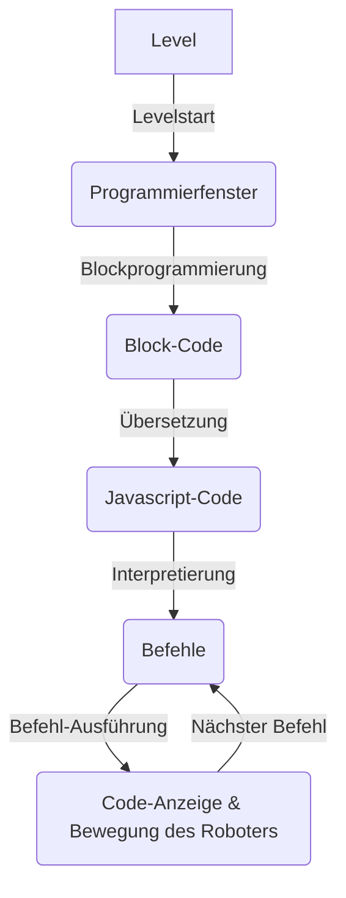

# BayernLab Software Demonstrator

<table align="center">
    <tr>
        <td> 
            <p align="center" style="padding: 10px">
                
                <br>
                <em style="color: grey">Screenshot des BayernLab Software Demonstartors</em>
            </p> 
        </td>
    </tr>
</table>

Der `BayernLab Software Demonstrator` ist ein webbasiertes Spiel zum Kennenlernen von grundlegenden Programmierkonzepten.
Die Anwendung ist für maximal vier Spieler ausgelegt und bietet die Möglichkeit zum kollaborativen Lernen in Gruppen.

Die Spieler müssen dabei ihre jeweilige Spielfigur (in der Form eines Roboters) durch Programmierung in einer Spielwelt mit mehreren Leveln an Hindernissen vorbei Schritt für Schritt an ein Ziel führen und lernen dabei in jedem Level neue Programmierelemente und Konzepte kennen.

# Eingesetzte Technologien

- [Phaser 3](https://github.com/photonstorm/phaser) - HTML5 game framework
- [enable3d](https://github.com/enable3d/enable3d) - 3d extension for Phaser Engine using [Three.js](https://github.com/mrdoob/three.js)
- [Blockly](https://github.com/google/blockly) - Block based programming framework (used in background for code validation/generation)
- [JavaScript Interpreter](https://github.com/NeilFraser/JS-Interpreter) - Step-based sandboxed JavaScript interpreter for generated code (from Blockly)

# Ablauf

Während ein Level bearbeitet wird werden die Blöcke nach und nach erst in Code und dann in Befehle umgewandelt, die der Computer Schritt für Schritt ausführt und den Roboter über das Spielfeld bewegt. Der Ablauf ist im folgenden schematisch dargestellt:



# Installation

```shell
npm install
```

# Ausführung

## Entwicklung

```shell
npm start
```

## Neue Version

```shell
npm run build
```

# Dokumentation

Die Nutzerdokumentation ist im Ordner ['./docs'](./docs) zu finden.

Die Code-Dokumentation ist direkt im Code enthalten (inline). Um aus dieser eine Dokumentation zu generieren kann `npm run doc:generate` ausgeführt werden.
Die Dokumentation ist dann im Ordner ['./docs/jsdoc'](./docs/jsdoc/) zu finden. Dort kann dann die [Hauptseite](./docs/jsdoc/index.html) zur Ansicht im Browser aufgerufen werden.
