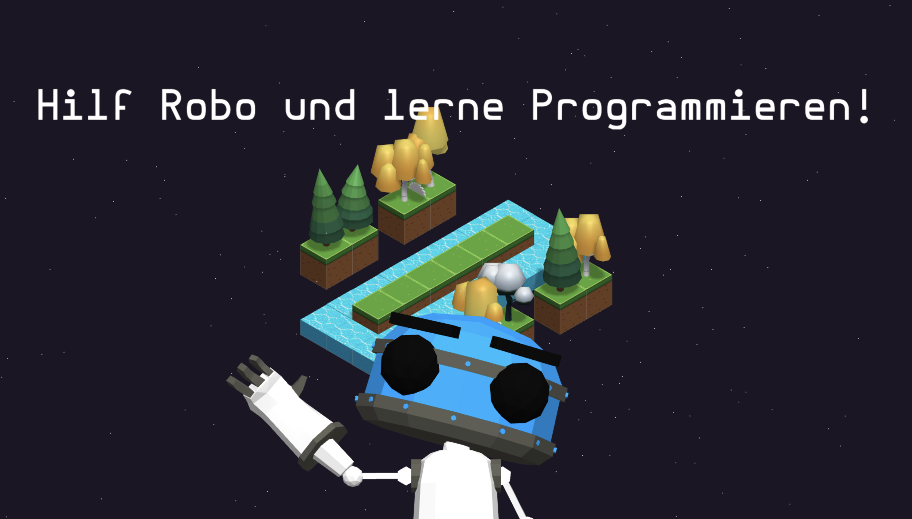
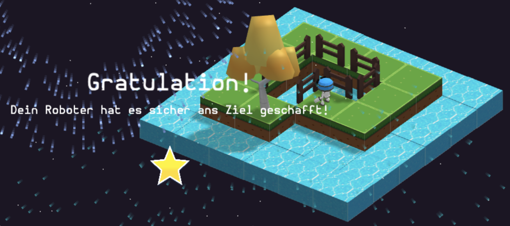

# Benutzerhandbuch

## Allgemeines

Ziel des Demonstrators ist es einem möglichst breiten Publikum ohne spezielle Vorkenntnisse ein praktisches Verständnis von Software zu entwickeln und zu demonstrieren, was Software ist und wie ein Softwareprogramm aussieht, aufgebaut ist und abläuft. Der Demonstrator soll erlauben Beispiele unter der Verwendung von Programmierbausteinen auszuprobieren und Lehrinhalte interaktiv und spielerisch zu vermitteln.

<table align="center">
    <tr>
        <td> 
            

                
                 
                <em style="color: grey">Hilf Robo und lerne Programmieren</em>
            
 
        </td>
    </tr>
</table>

## Konzept

Der Demonstrator ist als spielerische Mehrbenutzeranwendung entworfen, auf der ein bis vier Nutzer per Touch einen jeweiligen Roboter parallel programmieren und dem Roboter in einer Spielwelt an Hindernissen vorbei Schritt für Schritt an ein Ziel führen.

<table align="center">
    <tr>
        <td> 
            

                
                 
                <em style="color: grey">Programmiere Robo zum Ziel</em>
            
 
        </td>
    </tr>
</table>

### Programmierung

Softwareprogramme werden über vorgegebene Programmierbausteine - Blöcke - entwickelt, die aus einem Baukasten- der Toolbox - in eine Programmieroberfläche per Drag-and-Drop gezogen werden und dort zusammengebaut bzw. -gesteckt werden.

<table align="center">
    <tr>
        <td> 
            

                
                 
                <em style="color: grey">Toolbox mit Programmierthemen</em>
            
 
        </td>
        <td> 
            

                
                 
                <em style="color: grey">Programmierblöcke je Thema</em>
            
 
        </td>
    </tr>
</table>

Die verfügbaren Programmierbausteine variieren dabei je Lehrinhalt und sind auf diesen begrenzt, um Nutzer kontinuierlich an die jeweiligen Inhalte in mehreren Leveln heranzuführen.
Optional kann der Programmiercode eingeblendet werden, der hinter den Blöcken steckt und das Programm bildet.

### Karte

Die Spielwelt und die jeweiligen Roboter der Nutzer werden gemeinsam auf einer zentralen Karte angezeigt.

<table align="center">
    <tr>
        <td> 
            

                
                 
                <em style="color: grey">Karte bzw. Spielwelt</em>
            
 
        </td>
    </tr>
</table>

Die Karte dient als initiale Orientierung für die Nutzer, um den Roboter so zu programmieren, dass der Roboter an einen Zielpunkt gelangt, als auch als Ergebnisansicht für die Nutzer, um die Ausführung des Programms und die Fortbewegung des Roboters zu beobachten.

### Ausführung

Die Ausführung des Programms wird auf der Karte Schritt für Schritt je Block visualisiert. Zusätzlich wird der Code des Programms angezeigt und die jeweilige Codezeile gekennzeichnet, die gerade ausgeführt wird und auf der Karte zu sehen ist.

## Lerninhalte

Die Lerninhalte richten sich auf das grundsätzliche Verständnis, was ein Programm ist und wie es aufgebaut ist. Hierfür werden Anweisungen, Bedingungen, grundlegende Kontrollstrukturen und einfache Funktionen fokussiert. Um die Aufmerksamkeitsspanne und Komplexität nicht zu überstrapazieren, wurde bewusst auf weitere, grundlegende Inhalte wie Variablen und Speicherzuweisung verzichtet.

### Programme

Wir suchen nach einem Lösungsweg – den sogenannten Algorithmus – und implementieren diesen in einem Programm – der Software.
Ein Programm besteht aus einer Menge von Anweisungen – bei uns dargestellt als Blöcke.
In einem Programm werden Anweisungen normalerweise von oben nach unten nacheinander ausgeführt.
Das Programm – die Software – wird auf den Prozessoren – der Hardware – des Roboters ausgeführt und steuert die Beine, Arme und vieles mehr.

### Anweisungen

Anweisungen sind Befehle oder Arbeitsschritte.
Der Roboter kennt zum Beispiel die Anweisung „Schritt gehen“.

<table align="center">
    <tr>
        <td> 
            

                
                 
                <em style="color: grey">Block: Schritt gehen</em>
            
 
        </td>
    </tr>
</table>

Anweisungen können wiederum selbst aus anderen Anweisungen bestehen.
„Schritt gehen“ beinhaltet das Heben und Absetzen des Fußes, das Abwinkeln des Knies und vieles mehr.

### Kontrollstrukturen

Kontrollstrukturen geben die Reihenfolge von Anweisungen vor.

#### Schleifen

Schleifen wiederholen bzw. iterieren Anweisungen.

##### Zählergesteuerte Schleifen

Zählergesteuerte Schleifen haben einen Zähler. Dieser gibt die Anzahl der Wiederholungen an. Das, was „x“ mal wiederholt werden soll, wird in dem sogenannten Körper angewiesen. Dafür werden diese Anweisungen nach rechts gesondert eingerückt.  
Durch Berühren des Zählers kann die Anzahl an Wiederholungen ausgewählt werden.

<table align="center">
    <tr>
        <td> 
            

                
                 
                <em style="color: grey">Block: Zählergesteuerte Schleife</em>
            
 
        </td>
    </tr>
</table>

##### Verschachtelung

Schleifen und andere Anweisungen können ineinander geschachtelt werden. Das bedeutet, dass in dem Körper einer Schleife beliebig viele weitere Schleifen enthalten sein können und beliebig viel nach rechts eingerückt. Im Programmcode ist die Verschachtelung durch geschweifte Klammern dargestellt.

<table align="center">
    <tr>
        <td> 
            

                
                 
                <em style="color: grey">Verschachtelung von Blöcken</em>
            
 
        </td>
    </tr>
</table>

##### Bedingte Schleifen

Auch bedingte Schleifen erlauben es Anweisungen zu wiederholen. Dafür haben sie eine Bedingung. Solange diese Bedingung „Wahr“ ist, werden Anweisungen wiederholt. Das, was wiederholt werden soll, wird wieder in dem sogenannten Körper angewiesen. Auch hier werden diese Anweisungen dafür nach rechts gesondert eingerückt.
Wie schon bei zählergesteuerten Schleifen werden die Anweisungen zur Wiederholung im Körper der Schleife definiert. Nur gibt es bei der bedingten Schleife keine Zählvariable, sondern eine Bedingung, die erfüllt sein muss, um die Schleife ein wiederholtes Mal auszuführen.  
Für den Computer kommt es auf das Gleiche raus. Er kennt nur den Assembler-Befehl Vergleiche, mit dem man zwei Werte vergleichen kann. Bei der Zählvariable vergleicht er, ob die gewünschte Anzahl an Wiederholungen erreicht ist. Bei bedingten Schleifen vergleicht er eben, ob eine Bedingung zutrifft. Wenn der Vergleich als Wahr gewertet wird springt die Ausführung zurück zum Schleifenanfang. Ansonsten werden die Befehle nach der Schleife ausgeführt.

<table align="center">
    <tr>
        <td> 
            

                
                 
                <em style="color: grey">Block: Bedingte Schleife</em>
            
 
        </td>
    </tr>
</table>

#### Verzweigungen

Eine Verzweigung ist eine Anweisung, bei der eine Bedingung überprüft wird (auch Fallunterscheidung). Für jeden Fall – WAHR/FALSCH - steht ein eigener Körper für mögliche Anweisungen zu Verfügung.
Die Bedingung stellt so eine Abzweigung des Programmablaufs dar: „FALLS eine Bedingung zutrifft, MACHE etwas, ANSONSTEN etwas anderes“. Das ANSONSTEN kann dabei auch weggelassen werden.

<table align="center">
    <tr>
        <td> 
            

                
                 
                <em style="color: grey">Block: Verzweigung</em>
            
 
        </td>
    </tr>
</table>

### Bedingungen

Bedingungen erlauben Fallunterscheidungen.

#### Wahr und Falsch

Wir können zwischen Wahr (True; trifft zu) und Falsch (False; trifft nicht zu) unterscheiden. Beispielsweise können wir überprüfen, ob Wasser voraus ist („ist Wasser voraus“).

<table align="center">
    <tr>
        <td> 
            

                
                 
                <em style="color: grey">Block: Bedingung</em>
            
 
        </td>
    </tr>
</table>

Ob eine Bedingung zutrifft, zeigt der Roboter später durch Nicken oder Kopfschütteln an.
Durch Bedingungen können wir Entscheidungen treffen und den Ablauf von Programmen steuern.

#### Negierung

Es ist in der Programmierung möglich, die Auswertung jeder Bedingung in das Gegenteil umzukehren (aus Wahr wird Falsch und aus Falsch wird Wahr). Man spricht hierbei von Negierung. Dies kann besonders sinnvoll sein, wenn man überprüfen will, ob etwas NICHT zutreffend ist. Zum Beispiel könnten wir für unseren Roboter überprüfen, ob kein Wasser voraus ist (NICHT „ist Wasser voraus“).

<table align="center">
    <tr>
        <td> 
            

                
                 
                <em style="color: grey">Block: Negierung</em>
            
 
        </td>
    </tr>
</table>

### Funktionen

Eine Funktion ist eine Art Unterprogramm, das eine neue Anweisung bildet und den Vorteil bietet, mehrfach wieder verwendet zu werden.
Wie ein Programm besteht eine Funktion aus einer Menge von Anweisungen und sollte idealerweise einen Lösungsweg bzw. Algorithmus beschreiben.
Funktionen können helfen Wiederholungen zu vermeiden, Fehlerquellen bei der Programmierung zu reduzieren und mehr Funktionalität mit weniger Code umzusetzen. Deshalb lohnt es sich Funktionen immer dann einzusetzen, wenn gleiche Anweisungen mehrfach wiederholt programmiert werden oder eine neue logische Funktion bilden (Beispiel: Rechtsdrehen = 3x linksdrehen).

<table align="center">
    <tr>
        <td> 
            

                
                 
                <em style="color: grey">Block: Funktion definieren</em>
            
 
        </td>
        <td> 
            

                
                 
                <em style="color: grey">Block: Funktion anweisen</em>
            
 
        </td>
    </tr>
</table>

## Bedienung
Der "BayernLabs Software Demonstrator" ist eine Windowsanwendung und kann über das Windows-Programmmenü gestartet werden.

Zur einfachen Bedienung außerhalb des Spiels stehen folgende Tastaturkurzbefehle zu Verfügung: 

* `ALT + F4`: Anwendung schließen
* `ALT + F5`: Anwendung neu laden
* `ALT + ENTER`: Vollbild an/aus
* `ALT + DOWN`: Anwendung minimieren

Die Bedienung innerhalb des Spiels per Touch bzw. Berührung wird in den nachfolgenden Kapiteln genauer beschrieben.

## Spieldesign
Der Demonstrator bietet ein Hauptmenü und verschiedene Level, die je Lehrinhalt aufeinander aufbauen. In jedem Level steht die gleiche Navigation zu Verfügung.

<table align="center">
    <tr>
        <td> 
            

                
                 
                <em style="color: grey">Codevorschau</em>
            
 
        </td>
    </tr>
</table>

### Hauptmenü

Das Hauptmenü bietet vier Auswahlmöglichkeiten: die Auswahl von einem bis vier Charakteren bzw. Spielern, das Spiel von Beginn an zu starten, ein Level auszuwählen, um nur ein bestimmtes Level zu starten und, zuletzt, Einstellungen.

#### Wähle deinen Charakter

Die Auswahl ein oder mehrerer Charaktere bestimmt gleichzeitig die Anzahl der parallelen Spieler. Um einen Charakter auszuwählen, muss dieser in ein beliebiges der vier Auswahlfelder gezogen werden.

#### Spiel starten

Um das Spiel zu starten, müssen erst Charaktere ausgewählt werden, mindestens einer. Anschließend kann der Button *Spiel starten* berührt werden und das Spiel startet mit einem Tutorial. Dies ist vor allem für Spieler sinnvoll, die den Demonstrator zum ersten Mal nutzen.

#### Level auswählen

Um das Tutorial zu überspringen und bei einem späteren Level das Spiel zu starten, kann der Button "Level auswählen" berührt werden. Auch hier müssen vorher die Charaktere ausgewählt worden sein.

<table align="center">
    <tr>
        <td> 
            

                
                 
                <em style="color: grey">Codevorschau</em>
            
 
        </td>
    </tr>
</table>

#### Einstellungen

Die Einstellungen bieten drei Konfigurationen an.
Zunächst können die Aktivierungszonen, in die die Charaktere gezogen werden und die Spieler ausgewählt werden, entweder mittig oder an den Seiten platziert werden, je nachdem, ob der Tischbildschirm vertikal oder horizontal geneigt ist.
Die Platzierung der Kartenvorschau lässt sich ebenfalls bspw. in den Ecken konfigurieren.
Zuletzt können die Farben der vier Charaktere angepasst werden.

<table align="center">
    <tr>
        <td> 
            

                
                 
                <em style="color: grey">Codevorschau</em>
            
 
        </td>
    </tr>
</table>

### Navigation

Die Navigation im Spiel ist für alle Level gleich aufgebaut.

#### Karte und Spielwelt

In der Mitte befindet sich die Hauptkarte bzw. Spielwelt, die den gesamten Bildschirmhintergrund bildet. Auf dieser sind alle Spielcharaktere zu sehen, die möglichen Schritte, Hindernisse und das Ziel.
Nachdem die Charaktere von allen Spielern programmiert worden sind und die Ausführung gestartet wird, wirder der aktuelle Fortschritt aller Charaktere auf der Karte Schritt für Schritt angezeigt und abgespielt.

##### Minikarten

Des Weiteren befinden sich Minikarten an den Seiten, die den Spielern eine einfachere bzw. zusätzliche Orientierung bieten soll. Die Minikarte wird bei Berührung vergrößert bzw. verkleinert.

<table align="center">
    <tr>
        <td> 
            

                
                 
                <em style="color: grey">Minikarten</em>
            
 
        </td>
    </tr>
</table>

##### 2D / 3D

An der oberen Mitte des Bildschirmes kann zwischen einer 2D- und einer 3D Ansicht gewechselt werden. Sofern der Tisch horizontal geneigt ist und sich an jeder Ecke ein Spieler befindet, empfiehlt sich die 2D Ansicht zu wählen.

<table align="center">
    <tr>
        <td> 
            

                
                 
                <em style="color: grey">2D / 3D Schalter</em>
            
 
        </td>
    </tr>
</table>

##### Menü

Zuletzt kann man über den Menübutton zurück in das Hauptmenü gelangen oder das Level neustarten.

<table align="center">
    <tr>
        <td> 
            

                
                 
                <em style="color: grey">Menü Button</em>
            
 
        </td>
    </tr>
</table>

#### Charakter

Jeder Charakter kann durch eine gehaltene Berührung an die gewünschte Stelle auf dem Bildschirm durch den Spieler gezogen werden. Durch die Berührung und Drehung mit zwei Fingern, können der Charakter und die zugehörigen Fenster je nach Bedarf gedreht werden. 

Jeder Charakter hat mehrere Eigenschaften: eine Sprechblase, eine Toolbox mit einem Programmierfenster, eine Codevorschau und eine Information.

<table align="center">
    <tr>
        <td> 
            

                
                 
                <em style="color: grey">Charakter</em>
            
 
        </td>
    </tr>
</table>

##### Sprechblase

In der Sprechblase werden Informationen anzeigt und die Spieler auf das Level und die Aufgaben vorbereitet und angeleitet. Sobald ein Textabschnitt in der Sprechblase von einem Spieler gelesen wurde, kann durch Berühren der Sprechblase fortgefahren werden.

<table align="center">
    <tr>
        <td> 
            

                
                 
                <em style="color: grey">Sprechblase</em>
            
 
        </td>
    </tr>
</table>

##### Toolbox

Die Toolbox biete eine Auswahl an Programmierbausteinen bzw. Blöcken, die je Konzept gegliedert sein. Beispielsweise kann das Konzept *Anweisung* berührt werden, um alle Anweisungsblöcke zu sehen. Anschließend können die Anweisungsblöcke in das Programmierfenster gezogen werden.

<table align="center">
    <tr>
        <td> 
            

                
                 
                <em style="color: grey">Toolbox (links) mit Programmierthemen</em>
            
 
        </td>
    </tr>
</table>

Der Ausführungsbutton sollte berührt werden, sobald die Lösung als fertig erscheint und der Charakter das Programm ausführen soll.
Erst sobald alle Spieler den Ausführungsbutton berührt haben, wenden alle Charaktere ihr jeweiliges Programm gleichzeitig auf der Karte an und werden ausgeführt. Dies ermöglicht beispielsweise erfahreneren Spielern anderen Spielern zu helfen.

##### Programmierung

In dem Programmierfenster werden Blöcke angeordnet. Damit diese später ausgeführt werden, müssen diese miteinander verknüpft werden, ausgehend am vorgegebenen Startblock.
Durch Ziehen der Blöcke kann die Reihenfolge auch später noch in dem Programmierfenster anpasst werden.
Zudem befindet sich auf der Anzeigefläche ein Löschbutton, der erlaubt Blöcke wieder zu entfernen.

<table align="center">
    <tr>
        <td> 
            

                
                 
                <em style="color: grey">Programmierung (rechts) mit Blöcken</em>
            
 
        </td>
    </tr>
</table>

##### Codevorschau

Optional kann während der Programmierung mit Blöcken der resultierende Programmcode angezeigt werden.
In jedem Fall wird der Programmcode anzeigt, sobald der Ausführungsbutton berührt wurde.

<table align="center">
    <tr>
        <td> 
            

                
                 
                <em style="color: grey">Codevorschau</em>
            
 
        </td>
    </tr>
</table>

##### Informationen

Weiterhin können zusätzliche Informationen für interessierte Spieler optional angezeigt werden, die die jeweiligen Programmierkonzepte erläutern und erklären.

<table align="center">
    <tr>
        <td> 
            

                
                 
                <em style="color: grey">Zusätzliche Informationen</em>
            
 
        </td>
    </tr>
</table>

#### Versuch starten

Sobald alle Spieler den Ausführungsbutton berührt haben, erscheint zentral ein Button, um den Versuch zu starten. Das bedeutet: alle Charaktere führen ihren jeweiligen Programmcode aus und jeder Ausführungsschritt wird auf der Karte anzeigt.

<table align="center">
    <tr>
        <td> 
            

                
                 
                <em style="color: grey">Versuch starten</em>
            
 
        </td>
    </tr>
</table>

Zusätzlich wird der aktuelle Ausführungsschritt auf der jeweiligen Stelle der Codevorschau angezeigt, so dass Spieler sehen können, welcher Code gerade ausgeführt wird und ggf. welcher Schritt an welcher Stelle fehlschlägt. Beispielsweise signalisiert der Roboter per Nicken oder Kopfschütteln für den Code von Bedingungsweisungen, ob die Bedingung zutrifft oder nicht.

<table align="center">
    <tr>
        <td> 
            

                
                 
                <em style="color: grey">Versuch debuggen</em>
            
 
        </td>
    </tr>
</table>

## Leveldesign
Für die Konzepte und Lerninhalten wurden insgesamt neun Level entworfen. Ein einführendes Level, sieben Level analog zu den Lerninhalten und zwei abschließende Bonuslevel.

### Tutorial
Das erste Level ist eine Einführung und erklärt die Bedienung und die Konzepte des Demonstrators wie z. B. die Karte, den Charakter und alle zugehörigen Funktionalitäten und Eigenschaften.

<table align="center">
    <tr>
        <td> 
            

                
                 
                <em style="color: grey">Level 1</em>
            
 
        </td>
        <td> 
            

                
                 
                <em style="color: grey">Level 1 Beispiellösung</em>
            
 
        </td>
    </tr>
</table>

### Anweisungen
Das zweite Level erklärt dediziert den ersten Lerninhalt, die Anweisungen in Form von Bewegungen. 

<table align="center">
    <tr>
        <td> 
            

                
                 
                <em style="color: grey">Level 2</em>
            
 
        </td>
        <td> 
            

                
                 
                <em style="color: grey">Level 2 Beispiellösung</em>
            
 
        </td>
    </tr>
</table>

### Schleifen
Das dritte Level erläutert die Wiederholung bzw. die Iteration von Anweisungen und soll veranschaulichen, die gleiche Funktionalität mit einer geringeren Anzahl an Blöcken bzw. Anweisungen zu implementieren. Hierfür wird im oberen rechten Bereichs des Programmierfensters eine Limitation an Blöcken eingeführt. In diesem Level dürfen maximal vier Blöcke benutzt werden und es können nicht mehr als vier Blöcke aus der Toolbox in die Fläche gezogen werden.

<table align="center">
    <tr>
        <td> 
            

                
                 
                <em style="color: grey">Level 3</em>
            
 
        </td>
        <td> 
            

                
                 
                <em style="color: grey">Level 3 Beispiellösung</em>
            
 
        </td>
    </tr>
</table>

### Schachtelung
Das vierte Level demonstriert die Kombination und das Ineinanderfügen von Schleifen in Schleifen selbst. In ähnlicher Weise gibt es wieder eine Limitierung der Anzahl an Blöcken, die zur Lösung des Levels genutzt werden dürfen.

<table align="center">
    <tr>
        <td> 
            

                
                 
                <em style="color: grey">Level 4</em>
            
 
        </td>
        <td> 
            

                
                 
                <em style="color: grey">Level 4 Beispiellösung</em>
            
 
        </td>
    </tr>
</table>

### Bedingungen
Das fünfte Level führt Bedingungen als neues Konzept ein. Dies erfolgt am Beispiel einer neu eingeführten Schleife, der bedingten Schleifen. Hier veranschaulichen Bedingungen Lösungsmöglichkeiten für Fälle, in denen die Anzahl von Wiederholungen (zählergesteuerte Schleifen) nicht bekannt oder variabel ist.

<table align="center">
    <tr>
        <td> 
            

                
                 
                <em style="color: grey">Level 5</em>
            
 
        </td>
        <td> 
            

                
                 
                <em style="color: grey">Level 5 Beispiellösung</em>
            
 
        </td>
    </tr>
</table>

### Verzweigungen
Das sechste Level erklärt Fallunterscheidungen und die unterschiedliche Anwendung von Anweisungen je Bedingung.

<table align="center">
    <tr>
        <td> 
            

                
                 
                <em style="color: grey">Level 6</em>
            
 
        </td>
        <td> 
            

                
                 
                <em style="color: grey">Level 6 Beispiellösung</em>
            
 
        </td>
    </tr>
</table>

### Funktionen
Das siebte Level führt Funktionen als letztes Konzept ein, um Wiederverwendbarkeit und eine sehr einfache Kapselung zu veranschaulichen. Da das Level prinzipiell ohne Funktionen lösbar ist, werden in diesem Level die Anzahl an anwendbaren Blöcken wieder limitiert.  

<table align="center">
    <tr>
        <td> 
            

                
                 
                <em style="color: grey">Level 7</em>
            
 
        </td>
        <td> 
            

                
                 
                <em style="color: grey">Level 7 Beispiellösung</em>
            
 
        </td>
    </tr>
</table>

### Bonus: Der Boden ist Lava
Das vorletzte Level ist ein Bonuslevel. D.h. es führt keine neuen Konzepte mehr ein, sondern dient zur Vertiefung, Anwendung und Übung in einem neuen Umfeld. 

<table align="center">
    <tr>
        <td> 
            

                
                 
                <em style="color: grey">Level 8</em>
            
 
        </td>
        <td> 
            

                
                 
                <em style="color: grey">Level 8 Beispiellösung</em>
            
 
        </td>
    </tr>
</table>

### Bonus: Labyrinth II
Ebenso ist das letzte Level ein Bonus, bei dem die Lösung mit wenigen Blöcken besonders knifflig ist.

<table align="center">
    <tr>
        <td> 
            

                
                 
                <em style="color: grey">Level 9</em>
            
 
        </td>
        <td> 
            

                
                 
                <em style="color: grey">Level 9 Beispiellösung</em>
            
 
        </td>
    </tr>
</table>
